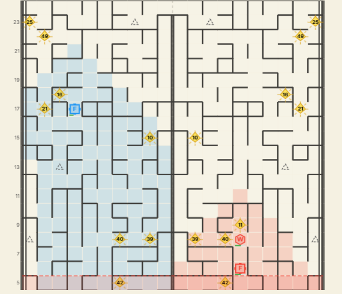

# Maze Crawler

A bot for the [Maze Crawler Kaggle Competition](https://www.kaggle.com/competitions/maze-crawler), a two-player strategy game where you control a factory robot navigating a fog-shrouded maze that scrolls northward over time.

<p align="center">
  
</p>

## What the Game Is

Two players each control a Factory robot placed on opposite halves of a 20x20 maze. The southern boundary of the map advances every turn, destroying anything it reaches. You must keep moving north to survive. The last factory standing wins.

The maze has walls blocking movement, fog limiting visibility, and a mirrored layout where the left half reflects the right half.

## Robot Types

| Robot   | Type ID | Cost | Energy | Speed       | Vision | Role                        |
|---------|---------|------|--------|-------------|--------|-----------------------------|
| Factory | 0       | free | unlimited | every 2 turns | 4  | Main unit, builds robots    |
| Scout   | 1       | 50   | 100    | every turn  | 5      | Fast exploration            |
| Worker  | 2       | 200  | 300    | every 2 turns | 3    | Breaks and builds walls     |
| Miner   | 3       | 300  | 500    | every 2 turns | 3    | Converts to energy mine     |

All robots consume 1 energy per turn. A robot with 0 energy goes idle.

## How This Bot Works

The bot uses a BFS-based movement system to navigate northward while managing wall obstacles.

**Factory** moves north using BFS over visible cells, weighted by distance. When stuck behind a wall, it moves south one cell, spawns a Worker, then waits.

**Worker** navigates to the wall blocking the factory and removes it using `REMOVE_DIR_NORTH` or `REMOVE_DIR_SOUTH` depending on which side of the wall it is on.

## Project Structure

```
main.py          Entry point, game loop logic
robots/
  robot.py       BFS movement shared by all robots
  factory.py     Factory-specific actions
  worker.py      Wall-breaking logic
```

 
## Key Logic
 
**Factory movement** uses BFS within a 4-cell vision range. It picks the direction with the highest reachable row weight, avoiding reversals.
 
**Wall breaking** works as follows. The Worker must stand on either side of a wall to remove it. If the Worker is north of the wall, it issues `REMOVE_DIR_SOUTH`. If it is south of the wall, it issues `REMOVE_DIR_NORTH`. Each break costs 100 energy.
 
**Spawning a Worker** requires no wall between the factory and the cell directly north. If a north wall is present, the factory moves south first to get a clear spawn cell.

## Wall Breaking

Walls are edges between cells. A worker standing at cell `(r, c)` can remove:

- The north wall with `REMOVE_NORTH`
- The south wall with `REMOVE_SOUTH`
- The east wall with `REMOVE_EAST`
- The west wall with `REMOVE_WEST`

Each wall break costs 100 energy. The worker must be on either side of the wall to remove it.

## Spawning a Worker

The factory spawns a worker one cell to its north. If a north wall is blocking that cell, the spawn fails. The factory must move to a clear cell before building.